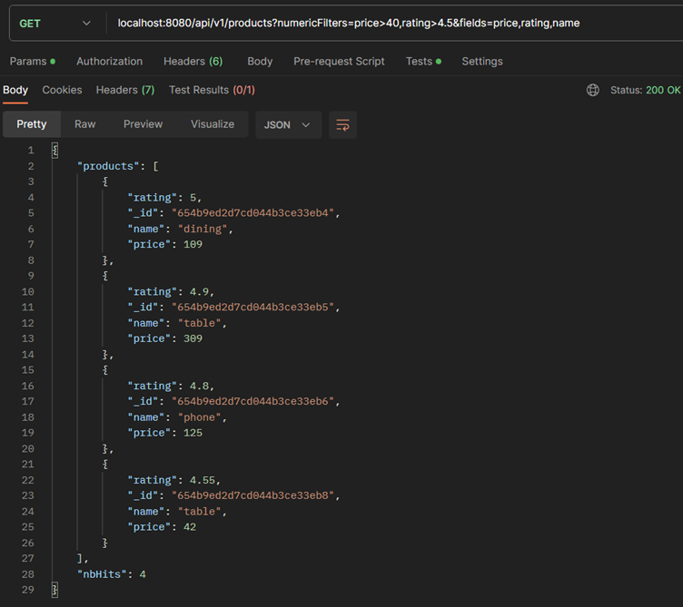

# Search-Store-API
Ability to log in, log out, search for reviews based on name, zipcode, cuisines, view reviews. Once logged in, user can add a review, update a review. User can only update a review if they posted it.
# ------------------------------------------
1.	.env has MONGO_URI (with collection name[test]) and PORT.
2.	Before starting server, data is first populated using node populate.js
3.	Then server is started.

NOTE: REMEMBER THAT NAME SEARCHES ARE REGEX SEARCHES.
# ------------------------------------------

 
Home page

 
localhost:8080/api/v1//products/numericFilters=price>30 : Showing prices >30

 
localhost:8080/api/v1//products/name=chair : Search by name. 

 
localhost:8080/api/v1//products/company=ikea&featured=false : Search by company name and featured status. 

 
localhost:8080/api/v1//products/name=arctic fox : Search by company name with space in company name.

 
localhost:8080/api/v1//products/featured=false&name=bed : Showing regex search. Search for products having bed in their name.

 
localhost:8080/api/v1//products/sort=name : Sort by name ascending

 
localhost:8080/api/v1//products/sort=-name : Sort by name descending

 
localhost:8080/api/v1//products/featured=true&numericFilters=price>40&fields=price,name&sort=-price : Show price and name for featured, where price>40. Sort by price desc.

 
localhost:8080/api/v1//products/fields=price,name : Show price and name only.

 
localhost:8080/api/v1//products/fields=price,name&limit=3 : Show price and name only, show 3 results only.

 
localhost:8080/api/v1//products/numericFilters=price>40&rating>4.5&fields=price,rating,name : Show price, rating, name for products with price>40 & rating>4.5. Showing multiple numeric filters. Numeric filters are only applied for numeric fields. If non-numeric fields are added they are not added to final query object.
